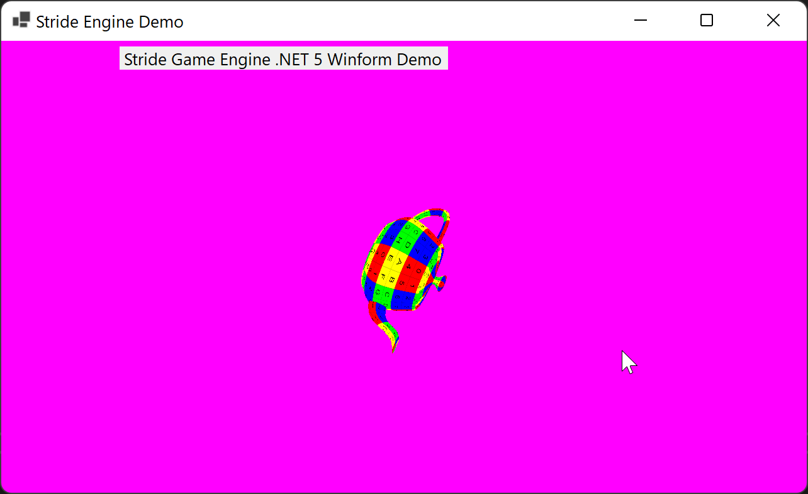

# Stride Game Engine embedding in .NET 8 Windows Forms and WPF

This demonstrates integrating the [Stride Game Engine](https://stride3d.net/) content in [Windows Forms](https://github.com/dotnet/winforms) Window:

